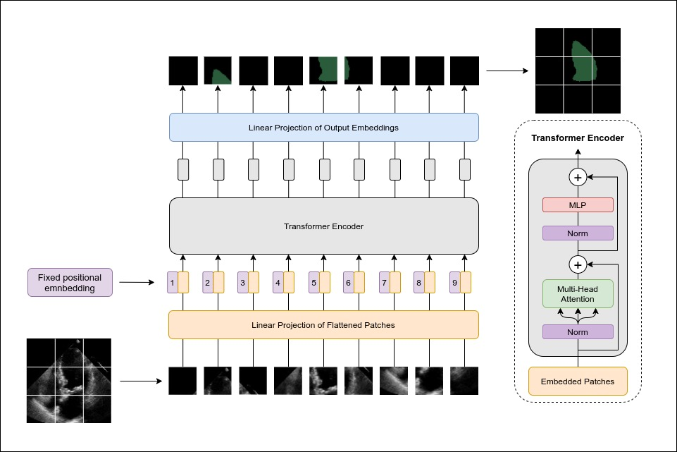

# Vision Transformer Segmentation Network

This implementation of [`ViT`](https://arxiv.org/abs/2010.11929) in pytorch uses a super simple and straight-forward way of generating an output of the same size as the input by applying the inverse rearrange operation on all the predicted outputs. This enables convolution-free multi-class segmentation.

Most of the code is taken from https://github.com/lucidrains/vit-pytorch/blob/main/vit_pytorch/vit.py

<p align="center">

</p>

## Default Architecture Parameters:

```
model = ViTSeg( image_size=112, 
                channels=1,
                patch_size=7, 
                num_classes=1, 
                dim=768, 
                depth=6, 
                heads=12, 
                mlp_dim=2048, 
                learned_pos=False, 
                use_token=False)
```

- ```image_size```: An integer or a tuple defining the size of the input image (some code rewrite would enable any image size to be passed)
- ```channels```: An integer defining the umber of channels in the input image
- ```patch_size```: An integer or a tuple defining the size of the patches
- ```num_classes```: An integer representing the nuber of channels in the ouput 
- ```dim```: An integer defining the size of the embedding dimension
- ```depth```: An integer defining the number of transformer layers
- ```heads```: An integer defining the number of heads in the transformer layers
- ```mlp_dim```: An integer defining the size of the MLP in the transformer layers
- ```learned_pos```: A boolean which, if true, switches from fixed positional encoding to learned positional encodings
- ```use_token```: A boolean which, if true, add a CLS token in the input and output


## Citation
If you find this repository useful, please consider citing it:
```
@article{reynaud2021vitseg,
  title={ViTSeg-https://github.com/HReynaud/ViTSeg}, 
  url={https://github.com/HReynaud/ViTSeg},  
  Author={Reynaud, Hadrien}, 
  Year={2021}
}
```